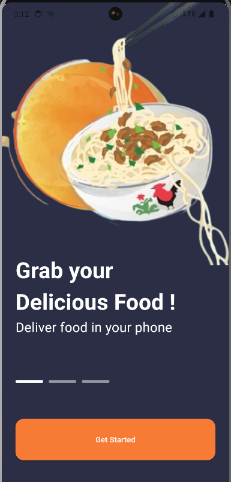
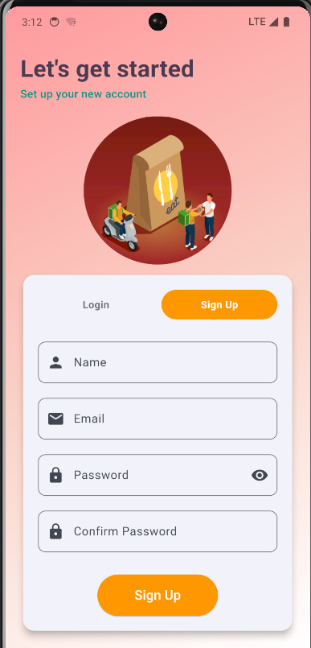
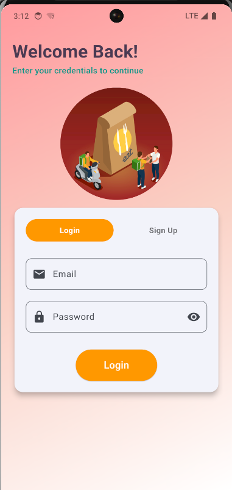
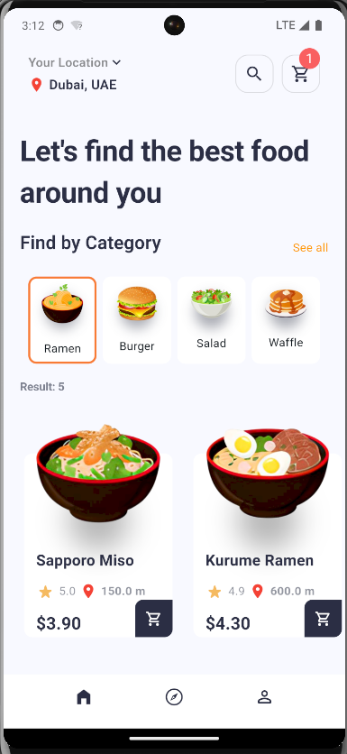
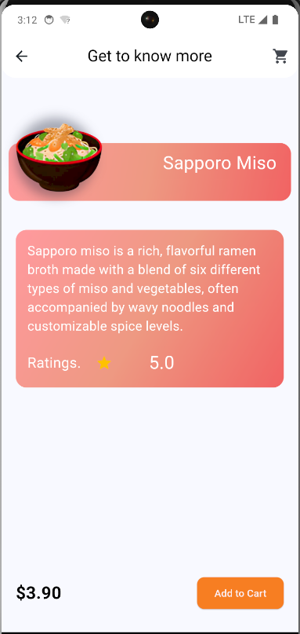
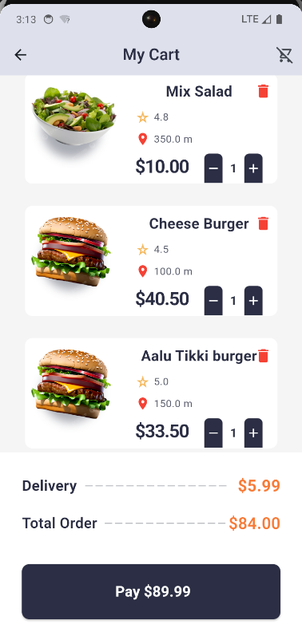
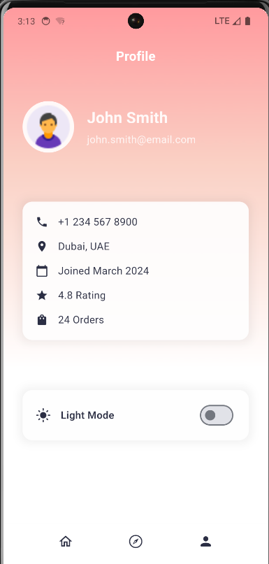
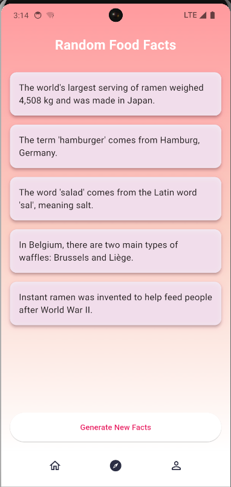

# Food Delivery App

A Flutter-based mobile application for ordering food online. This project demonstrates a complete food delivery system with features like browsing products, adding items to cart, and managing orders.

## Table of Contents
1. [Project Overview](#project-overview)
2. [Key Features](#key-features)
3. [Technologies Used](#technologies-used)
4. [Project Structure](#project-structure)
5. [Setup Instructions](#setup-instructions)
6. [Usage](#usage)
<!-- 7. [Contributing](#contributing) -->

## Project Overview

This Flutter project is designed to provide a seamless food delivery experience for users. It allows customers to browse various food categories, select items, add them to their cart, and place orders for delivery. The app is built with Flutter, ensuring cross-platform compatibility for both Android and iOS devices.

## Key Features

- User-friendly interface for browsing food categories
- Product filtering based on categories
- Shopping cart management
- Order placement functionality

## Technologies Used

- Flutter: Cross-platform UI toolkit
- Dart: Programming language for Flutter
- Provider: State management solution for seamless performance

## Project Structure

food_delivery/ ├── android/ ├── assets/ ├── ios/ ├── lib/ │ ├── models/ │ │ ├── category_model.dart │ │ └── my_product_model.dart │ ├── Provider/ │ │ └── cart_provider.dart │ ├── view/ │ │ ├── home_page.dart │ │ └── cart.dart │ └── Widgets/ │ └── food_product_items.dart ├── test/ └── web/

## Dribbble Design
[View the Dribbble Design Inspiration](https://dribbble.com/shots/18302635-Food-Delivery-App-Foodel)

## Screenshot of the Food Delivery App

## Watch the app in demo
[Watch the video](assets/screenshots/feast_fetch.mkv)

## Setup Instructions

To set up the project locally:

1. Install Flutter SDK from [flutter.dev](https://flutter.dev/docs/get-started/install)
2. Set up your development environment according to Flutter's official documentation
3. Clone the repository and navigate to the project directory
4. Run `flutter pub get` to install dependencies
5. Ensure Firebase is properly configured in the project

## Usage

1. Open the app and browse through different food categories
2. Select items to add them to your cart
3. View your cart and manage your orders
4. Place orders for delivery